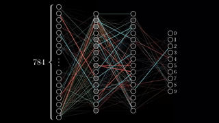

### Hi there, I'm Ankan [website] 😃

## I'm a Data Science Enthusiast, Kaggler, Developer

- 🔭 I joined as AI engineer Intern at DCKAP
- 🔘 I’m currently focusing on deep learning
- 👥 I’m looking to collaborate with developers on deep learning projects
- 👀 2020 Goals: Learn and built more deep learning projets
- 💖 Hobbies: I love digital art, history and geo-politics

## You can found me at

---

                                                                              
---

[website]: http://datasciencey.blogspot.com/
[linkedIn]: https://www.linkedin.com/in/ankan-sharma-589841198/
[kaggle]: https://www.kaggle.com/ankan1998
